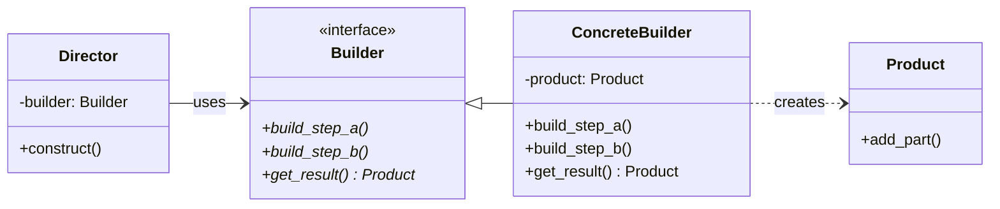

# The Builder Design Pattern: A Deep Dive

In Low-Level Design (LLD), we often encounter classes that require a large number of configuration parameters during instantiation. When a constructor has too many parameters, many of which are optional, it leads to the **Telescoping Constructor** anti-pattern. 

The **Builder Design Pattern** is a creational pattern designed to solve this by separating the construction of a complex object from its representation, allowing you to build the object step-by-step.

---

## 1. The Core Problem: Telescoping Constructors

Imagine you are designing a class to represent a custom **Desktop Computer**. A computer can have many components: CPU, GPU, RAM, Storage, Sound Card, Wi-Fi Card, cooling systems, etc. Some are mandatory, while others are optional.

Without a builder, your constructor might look like this:

```python
# The "Telescoping Constructor" / Constructor Bloat problem
class Computer:
    def __init__(self, cpu, ram, storage, gpu=None, sound_card=None, wifi=None, water_cooling=False):
        self.cpu = cpu
        self.ram = ram
        self.storage = storage
        self.gpu = gpu
        self.sound_card = sound_card
        self.wifi = wifi
        self.water_cooling = water_cooling
```

While Python handles optional arguments gracefully with default parameters, this approach has several LLD flaws:
1.  **Readability**: Instantiating a computer with many arguments becomes a long, unreadable line of code.
2.  **Immutability & Validity**: If we create the object in a half-constructed state, or modify attributes directly, we risk creating invalid states (e.g., a computer with water cooling but no CPU).
3.  **Telescoping Chains**: In languages like Java or C++ that do not support named arguments, developers must write multiple overloaded constructors, creating a messy "telescoping" chain of methods.

---

## 2. Builder Pattern Structure

The GoF (Gang of Four) Builder pattern introduces four key roles:

1.  **Product**: The complex object we want to construct (e.g., `Computer`).
2.  **Builder (Abstract)**: An interface that defines all the individual steps required to build the product.
3.  **Concrete Builder**: Implements the builder interface, maintains the product instance under construction, and provides a `build()` method to return the final product.
4.  **Director**: Directs *how* the building steps are executed. It defines the order of construction (e.g., configuring a "Gaming PC" vs. an "Office PC").



---

## 3. Python Implementation (Classic GoF Style)

Here is how to implement the classic Builder pattern using a **Director** to define pre-set configurations:

```python
from abc import ABC, abstractmethod

# 1. Product
class Computer:
    def __init__(self):
        self.cpu = None
        self.ram = None
        self.storage = None
        self.gpu = None
        self.water_cooling = False

    def __str__(self):
        parts = [f"CPU: {self.cpu}", f"RAM: {self.ram}", f"Storage: {self.storage}"]
        if self.gpu:
            parts.append(f"GPU: {self.gpu}")
        if self.water_cooling:
            parts.append("Water Cooling: Yes")
        return f"Computer Configurations: [{', '.join(parts)}]"

# 2. Abstract Builder
class ComputerBuilder(ABC):
    @abstractmethod
    def install_cpu(self) -> None: pass
    
    @abstractmethod
    def install_ram(self) -> None: pass
    
    @abstractmethod
    def install_storage(self) -> None: pass
    
    @abstractmethod
    def install_gpu(self) -> None: pass
    
    @abstractmethod
    def install_cooling(self) -> None: pass
    
    @abstractmethod
    def get_computer(self) -> Computer: pass

# 3. Concrete Builder
class GamingComputerBuilder(ComputerBuilder):
    def __init__(self):
        self.reset()

    def reset(self):
        self._computer = Computer()

    def install_cpu(self):
        self._computer.cpu = "Intel Core i9"

    def install_ram(self):
        self._computer.ram = "32GB DDR5"

    def install_storage(self):
        self._computer.storage = "2TB NVMe SSD"

    def install_gpu(self):
        self._computer.gpu = "NVIDIA RTX 4090"

    def install_cooling(self):
        self._computer.water_cooling = True

    def get_computer(self) -> Computer:
        product = self._computer
        self.reset()  # Reset builder state for next build
        return product

# 4. Director
class ComputerDirector:
    def __init__(self):
        self._builder = None

    @property
    def builder(self) -> ComputerBuilder:
        return self._builder

    @builder.setter
    def builder(self, builder: ComputerBuilder):
        self._builder = builder

    def build_minimal_computer(self):
        self.builder.install_cpu()
        self.builder.install_ram()
        self.builder.install_storage()

    def build_high_performance_computer(self):
        self.builder.install_cpu()
        self.builder.install_ram()
        self.builder.install_storage()
        self.builder.install_gpu()
        self.builder.install_cooling()
```

### Usage
```python
if __name__ == "__main__":
    director = ComputerDirector()
    gaming_builder = GamingComputerBuilder()
    
    director.builder = gaming_builder
    
    # Construct a high performance PC
    director.build_high_performance_computer()
    gaming_pc = gaming_builder.get_computer()
    print(gaming_pc)
    # Output: Computer Configurations: [CPU: Intel Core i9, RAM: 32GB DDR5, Storage: 2TB NVMe SSD, GPU: NVIDIA RTX 4090, Water Cooling: Yes]
```

---

## 4. Modern Fluent Builder Style (Method Chaining)

In modern software development, we often skip the **Director** class. Instead, we write the builder methods to return `self`. This allows method calls to be chained together sequentially (a **fluent interface**), culminating in a call to `.build()`.

This is incredibly popular in libraries for creating HTTP requests, database queries, and test assertions.

```python
class HTTPRequest:
    def __init__(self):
        self.url = None
        self.method = "GET"
        self.headers = {}
        self.body = None

    def __str__(self):
        return f"{self.method} {self.url} | Headers: {self.headers} | Body: {self.body}"

class HTTPRequestBuilder:
    def __init__(self):
        self._request = HTTPRequest()

    def set_url(self, url: str):
        self._request.url = url
        return self  # Return self to enable chaining

    def set_method(self, method: str):
        self._request.method = method
        return self

    def add_header(self, key: str, value: str):
        self._request.headers[key] = value
        return self

    def set_body(self, body: str):
        self._request.body = body
        return self

    def build(self) -> HTTPRequest:
        # Perform validation checks here before returning the final object
        if not self._request.url:
            raise ValueError("URL is mandatory to build an HTTP request!")
        return self._request

# --- Usage ---
request = (HTTPRequestBuilder()
           .set_url("https://api.example.com/users")
           .set_method("POST")
           .add_header("Content-Type", "application/json")
           .set_body('{"name": "Gokul"}')
           .build())

print(request)
# Output: POST https://api.example.com/users | Headers: {'Content-Type': 'application/json'} | Body: {"name": "Gokul"}
```

---

## 5. Pros & Cons of the Builder Pattern

### Pros
*   **Encapsulates Construction**: Separates instantiation steps from the main representation.
*   **Promotes Immutability**: You can construct a builder, configure it, and only construct the product at the final step, making the product immutable once built.
*   **Step-by-Step Construction**: Enables deferred construction or recursive object assembly.
*   **Improves Code Readability**: Chaining methods together makes instantiation code resemble a declarative domain-specific language (DSL).

### Cons
*   **Code Bloat**: Requires creating multiple classes (Product, Builder, Concrete Builders, optional Director).
*   **Tight Coupling**: The builder class must be updated whenever attributes are added or altered on the product.

---

## ✍️ Practice Exercises

We have prepared exercises for you in this directory:
- [exercise.py](file:///V:/workspace/system-design/lld/design-patterns/builder/exercise.py): Code skeleton for the practice challenges. Open it to write your implementation.

### Challenge: SQL Query Builder
You are writing a database library. To help users write SQL queries safely and avoid SQL syntax errors, you decide to write a fluent SQL query builder. 

Implement a class `SQLQueryBuilder` that builds a query string incrementally using method chaining.

1.  **Builder Methods**:
    *   `select(columns)`: Receives columns to select (e.g. `"id, name"` or list `["id", "name"]`).
    *   `from_table(table_name)`: Receives the target table name.
    *   `where(condition)`: Adds a WHERE condition. If multiple `where()` calls are made, they should be combined with `" AND "`.
    *   `limit(number)`: Limits the number of records.
2.  **`build()` Method**:
    *   Constructs and returns the final query string.
    *   Raises a `ValueError` if either `select` or `from_table` has not been defined (both are mandatory).
    *   Example final query: `SELECT id, name FROM users WHERE age > 21 AND status = 'active' LIMIT 10;`
