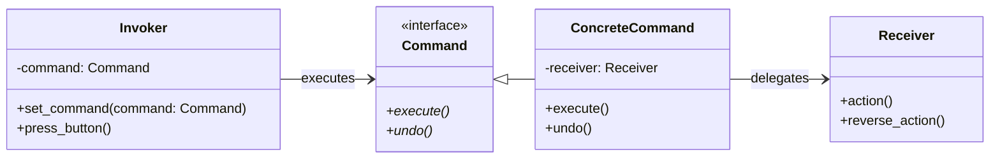

# The Command Design Pattern: A Deep Dive

In object-oriented software engineering, we often need to trigger actions from a sender (like a UI button, a remote control, or a keyboard shortcut) to a receiver (like a database service, light bulb, or document editor). If the sender invokes methods on the receiver directly, they become **tightly coupled**. If the receiver's API changes, all senders break. Furthermore, it becomes nearly impossible to support features like **Undo/Redo**, command queuing, or command logging.

The **Command Design Pattern** is a behavioral pattern that turns a request into a stand-alone object containing all information about the request. This transformation lets you parameterize methods with different requests, delay or queue a request's execution, and support undoable operations.

---

## 1. The Core Problem: Tightly Coupled Actions

Imagine you are building a **Text Editor Application** with a toolbar. The toolbar has buttons for **Copy**, **Paste**, and **Cut**.

### The Coupled Way
If each toolbar button holds a direct reference to the active `Document` and calls its methods:
```python
class SaveButton:
    def __init__(self, document):
        self.document = document

    def click(self):
        self.document.save_to_disk()
```
If we want to trigger the "Save" action via a keyboard shortcut (e.g., `Ctrl+S`), we have to replicate this reference and logic inside the keyboard shortcut listener. If we want to support an **Undo Stack**, we cannot easily track what actions the user took because the execution is scattered and hardcoded.

### The Command Solution: Reified Requests
A Command object acts as a bridge. It implements a standard interface (e.g., `execute()`) and wraps the receiver. The sender (invoker) only knows about the standard interface.

---

## 2. Command Pattern Structure

1.  **Command (Interface)**: Declares a method for executing an action (typically `execute()`), and optionally `undo()`.
2.  **Concrete Command**: Implements `execute()` by invoking the corresponding operations on the **Receiver**.
3.  **Receiver**: The class containing the actual business logic (e.g., `Document`, `Light`).
4.  **Invoker**: The sender that triggers the command (e.g., `Button`, `RemoteControl`). It stores the Command object and calls `command.execute()`.
5.  **Client**: Configures the connection: instantiates the Receiver, instantiates the Command (passing it the Receiver), and associates it with the Invoker.



---

## 3. Python Implementation (with Undo/Redo)

Here is a Text Editor example that supports an **Undo History stack**:

```python
from abc import ABC, abstractmethod

# 1. Receiver
class TextDocument:
    def __init__(self):
        self.text = ""

    def write(self, text_to_append: str) -> None:
        self.text += text_to_append

    def delete(self, length: int) -> str:
        deleted = self.text[-length:]
        self.text = self.text[:-length]
        return deleted

# 2. Command Interface
class Command(ABC):
    @abstractmethod
    def execute(self) -> None:
        pass

    @abstractmethod
    def undo(self) -> None:
        pass

# 3. Concrete Command
class WriteCommand(Command):
    def __init__(self, doc: TextDocument, text: str):
        self.doc = doc
        self.text = text

    def execute(self) -> None:
        self.doc.write(self.text)

    def undo(self) -> None:
        # To undo a write, we delete the length of text we just added
        self.doc.delete(len(self.text))

# 4. Invoker (Manages history)
class EditorHistory:
    def __init__(self):
        self._history = []

    def execute_command(self, command: Command) -> None:
        command.execute()
        self._history.append(command)

    def undo(self) -> None:
        if not self._history:
            print("Nothing to undo!")
            return
        command = self._history.pop()
        command.undo()
```

### Usage
```python
if __name__ == "__main__":
    doc = TextDocument()
    history = EditorHistory()

    # User writes "Hello "
    history.execute_command(WriteCommand(doc, "Hello "))
    # User writes "World!"
    history.execute_command(WriteCommand(doc, "World!"))
    print(f"Current document state: '{doc.text}'")  # Output: 'Hello World!'

    # User triggers Undo
    history.undo()
    print(f"After undo: '{doc.text}'")  # Output: 'Hello '
```

---

## 4. Pros & Cons of the Command Pattern

### Pros
*   **Decouples Sender & Receiver**: Senders only trigger `execute()`; they don't care about receivers' APIs.
*   **Supports Undo/Redo**: By storing commands in a list/stack, you can undo operations by popping them and calling `undo()`.
*   **Supports Queues & Scheduling**: Commands are standard objects, so they can be serialized, added to queues, delayed, or sent over a network.
*   **Adheres to OCP**: You can introduce new command classes without modifying any existing invoker or receiver code.

### Cons
*   **Class Proliferation**: You have to write a separate class for every single action, which can bloat the codebase.
*   **State Overhead**: For complex undo operations, you might need to save deep copies of state, which consumes memory.

---

## ✍️ Practice Exercises

We have prepared exercises for you in this directory:
- [exercise.py](file:///V:/workspace/system-design/lld/design-patterns/command/exercise.py): Code skeleton for the practice challenges. Open it to write your implementation.

### Challenge: Smart Home Automation Remote Control
You are building a universal smart home remote control system. The remote has buttons that can be assigned to different smart devices. The system must support:
1.  **Light Control**: Can turn a light `on()` or `off()`.
2.  **Stereo Control**: Can adjust volume: `set_volume(level)`.
3.  **Undo and Redo**: The remote control contains an execution history. Pressing the "Undo" button reverses the last executed command. Pressing the "Redo" button re-executes the last undone command.

Your task:
1.  Define the abstract `Command` class with `execute()` and `undo()` methods.
2.  Implement concrete commands:
    *   `LightOnCommand` and `LightOffCommand`.
    *   `StereoVolumeCommand` (Must remember the previous volume to support `undo()`).
3.  Implement the `RemoteControl` invoker class:
    *   Stores `undo_stack` and `redo_stack`.
    *   Provides `press_button(command)` (clears the redo stack when a new command is executed).
    *   Provides `press_undo()` and `press_redo()`.
