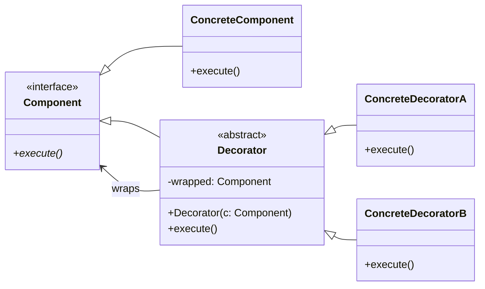

# The Decorator Design Pattern: A Deep Dive

In object-oriented system design, we often need to extend or alter the behavior of an object. While the default instinct might be to use **inheritance** (subclassing), this often leads to a rigid, compile-time structure and a massive **class explosion** when multiple independent extensions need to be combined.

The **Decorator Design Pattern** is a structural pattern that allows you to dynamically attach new behaviors to objects at runtime by placing them inside special wrapper objects that contain these behaviors.

---

## 1. The Core Problem: Class Explosion

Imagine you are designing the backend for a **Coffee Shop Ordering App**. 
You have a base `Coffee` class. Customers can customize their drink with multiple add-ons:
*   Milk (+$0.50)
*   Sugar (+$0.20)
*   Whipped Cream (+$0.70)
*   Caramel Drizzle (+$0.60)

### The Bad Way: Static Inheritance
If you try to represent every possible combination using inheritance:
*   `class CoffeeWithMilk`
*   `class CoffeeWithMilkAndSugar`
*   `class CoffeeWithMilkAndWhip`
*   `class CoffeeWithMilkSugarAndWhip`
*   ...and so on.

For just 4 add-ons, you would need **16 separate classes** to cover all combinations! If you add a 5th add-on, it doubles to **32 classes**. This is called **class explosion** and is completely unmaintainable.

### The Decorator Solution: Composition
Instead of extending the base class directly, we wrap the base object inside decorator objects. Both the base object and the decorators implement the **same interface**.

```text
Double-Mocha Latte order is constructed as:
[ CaramelDecorator -> [ MilkDecorator -> [ SimpleCoffee ] ] ]
```
When `get_cost()` is called on the outermost decorator, it calls `get_cost()` on the inner object it wraps, adds its own cost, and returns the total.

---

## 2. Decorator Pattern Structure

1.  **Component**: Defines the interface for both the objects that can be decorated and the decorators themselves.
2.  **Concrete Component**: The basic object being wrapped (e.g., `SimpleCoffee`).
3.  **Decorator (Base)**: Has a reference field that points to the wrapped component, and implements the Component interface.
4.  **Concrete Decorators**: Override the Component's methods to add new behavior before or after delegating to the wrapped component.



---

## 3. Python Implementation

Here is the Coffee Shop ordering system built using the Decorator design pattern:

```python
from abc import ABC, abstractmethod

# 1. Component Interface
class Beverage(ABC):
    @abstractmethod
    def get_description(self) -> str:
        pass

    @abstractmethod
    def get_cost(self) -> float:
        pass

# 2. Concrete Component
class Espresso(Beverage):
    def get_description(self) -> str:
        return "Espresso"

    def get_cost(self) -> float:
        return 1.99

# 3. Base Decorator (Implements Beverage, wraps another Beverage)
class AddonDecorator(Beverage, ABC):
    def __init__(self, beverage: Beverage):
        self._beverage = beverage

# 4. Concrete Decorators
class Milk(AddonDecorator):
    def get_description(self) -> str:
        return self._beverage.get_description() + ", Milk"

    def get_cost(self) -> float:
        return self._beverage.get_cost() + 0.50

class Caramel(AddonDecorator):
    def get_description(self) -> str:
        return self._beverage.get_description() + ", Caramel"

    def get_cost(self) -> float:
        return self._beverage.get_cost() + 0.60

# --- Usage ---
if __name__ == "__main__":
    # 1. Order a plain Espresso
    drink1 = Espresso()
    print(f"{drink1.get_description()} -> ${drink1.get_cost():.2f}")
    # Output: Espresso -> $1.99

    # 2. Order an Espresso with Milk
    drink2 = Milk(drink1)
    print(f"{drink2.get_description()} -> ${drink2.get_cost():.2f}")
    # Output: Espresso, Milk -> $2.49

    # 3. Order an Espresso with Milk and double Caramel
    drink3 = Caramel(Caramel(drink2))
    print(f"{drink3.get_description()} -> ${drink3.get_cost():.2f}")
    # Output: Espresso, Milk, Caramel, Caramel -> $3.69
```

---

## ⚠️ Key Interview Distinction: Design Pattern vs. Python Syntactic Decorator

In Python interviews, do not confuse the **Decorator Design Pattern** with **Python's `@decorator` syntax**. 

| Aspect | Decorator Design Pattern | Python Function Decorator (`@`) |
| :--- | :--- | :--- |
| **Type** | Structural Object-Oriented Pattern. | Syntactic sugar built into Python. |
| **Mechanism** | Object composition & polymorphism. | High-order function wrapping (takes a function, returns a function). |
| **Lifecycle** | Objects are wrapped **dynamically at runtime**. | Functions are wrapped **at import/compile time**. |
| **Use case** | Extending class behaviors dynamically. | Cross-cutting concerns like logging, access control, caching. |

---

## 4. Pros & Cons of the Decorator Pattern

### Pros
*   **Adheres to OCP**: You can add new behaviors by writing new decorators without modifying existing component classes.
*   **Adheres to SRP**: You divide monolithic classes that contain all behaviors into multiple smaller, specialized classes.
*   **Runtime Flexibility**: You can combine multiple behaviors arbitrarily (e.g., adding/removing features on the fly).

### Cons
*   **Order Dependency**: Some wrapping combinations may be order-dependent, which can lead to bugs if not handled carefully.
*   **Code Verbosity**: Constructing long-nested objects (`Caramel(Milk(Espresso()))`) is verbose and ugly. (Often combined with a **Builder** or **Factory** pattern to hide construction complexity).
*   **Debugging Pain**: It can be difficult to track bugs through deep wrapping layers.

---

## ✍️ Practice Exercises

We have prepared exercises for you in this directory:
- [exercise.py](file:///V:/workspace/system-design/lld/design-patterns/decorator/exercise.py): Code skeleton for the practice challenges. Open it to write your implementation.

### Challenge: Multi-Layered Notification Service
You are designing a notification subsystem. The core system sends a basic text alert. Based on user configurations, the system must dynamically wrap this alert to send notifications to extra channels:
1.  **Email**: Wraps notification and adds `"[Email] "` prefix.
2.  **SMS**: Wraps notification and adds `"[SMS] "` prefix.
3.  **Slack**: Wraps notification and adds `"[Slack] "` prefix.

Your task:
1.  Define the `Notifier` abstract base class with a `send(message: str) -> str` method.
2.  Implement `BaseNotifier` (returns the original message).
3.  Implement the base decorator `NotifierDecorator`.
4.  Implement the concrete decorators: `EmailDecorator`, `SMSDecorator`, `SlackDecorator`.
5.  Allow developers to nest them in any order to send notifications to multiple destinations simultaneously. E.g., wrapping a notifier in `SMS` and `Slack` should produce `"[SMS] [Slack] Alert Message"`.
