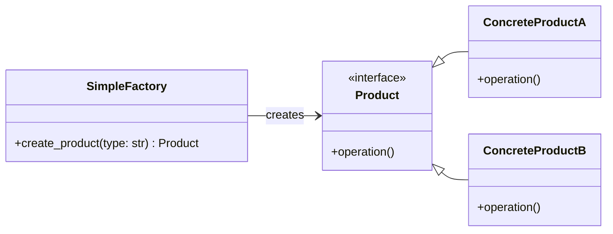
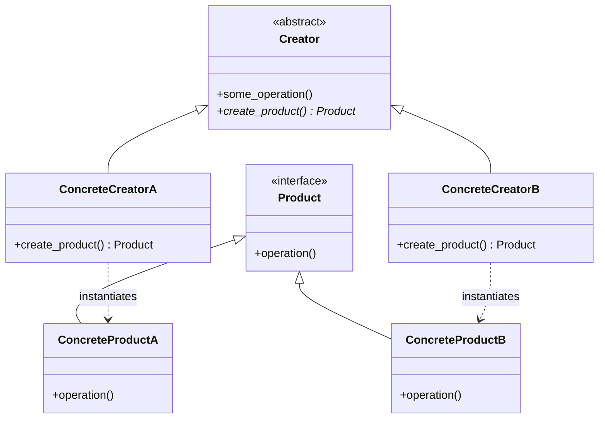
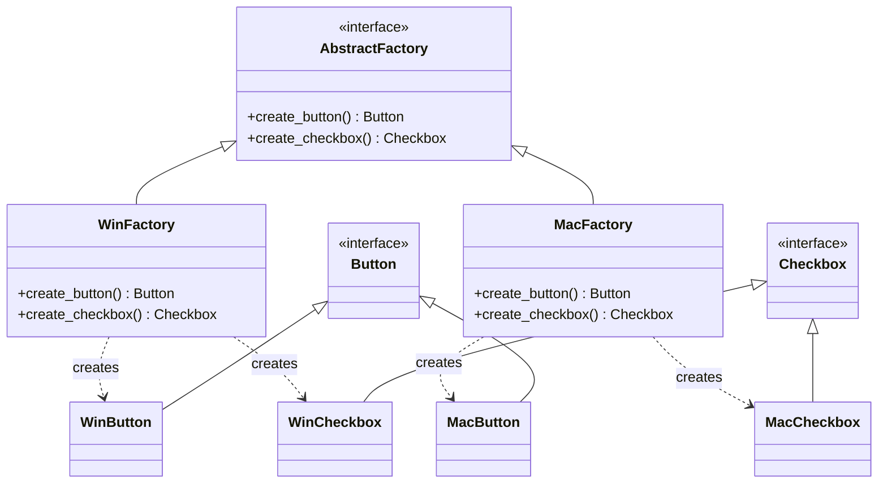

# The Factory Design Pattern: A Deep Dive

In Low-Level Design (LLD), one of the most fundamental principles is to **decouple the creation of objects from their usage**. When client code uses the `new` keyword (or direct instantiation like `Class()` in Python) everywhere, it creates a tight coupling known as the **"New is Glue"** problem. If you ever need to change the class name, constructor signature, or instantiation logic, you have to modify it in every single place where it is used.

The **Factory Pattern** solves this problem by encapsulating object creation logic.

There are three common variations of the Factory pattern:
1. **Simple Factory** (Not a formal GoF pattern, but widely used)
2. **Factory Method** (GoF Creational Pattern)
3. **Abstract Factory** (GoF Creational Pattern)

---

## 1. Simple Factory

### Concept
The **Simple Factory** is a helper class or method that creates objects of different classes based on the input argument. It centralizes the instantiation logic in one place.



### Python Example

```python
from abc import ABC, abstractmethod

# Product Interface
class Notification(ABC):
    @abstractmethod
    def send(self, message: str) -> None:
        pass

# Concrete Products
class EmailNotification(Notification):
    def send(self, message: str) -> None:
        print(f"Sending Email: {message}")

class SMSNotification(Notification):
    def send(self, message: str) -> None:
        print(f"Sending SMS: {message}")

# Simple Factory
class NotificationFactory:
    @staticmethod
    def create_notification(channel: str) -> Notification:
        if channel == "email":
            return EmailNotification()
        elif channel == "sms":
            return SMSNotification()
        else:
            raise ValueError(f"Unknown notification channel: {channel}")

# Client Code
if __name__ == "__main__":
    # The client doesn't know about EmailNotification or SMSNotification classes
    notification = NotificationFactory.create_notification("email")
    notification.send("Hello via Email!")
```

### Pros & Cons
*   **Pros:** Separates object creation from business logic; simplifies client code.
*   **Cons:** Violates the **Open-Closed Principle (OCP)**. Every time you add a new product type, you must modify the `NotificationFactory` class code (specifically, the conditional statements).

---

## 2. Factory Method (GoF)

### Concept
The **Factory Method** pattern defines an interface for creating an object, but lets subclasses decide which class to instantiate. It delegates the instantiation to subclasses.

Instead of a single factory class with conditionals, we have a base **Creator** class with a virtual/abstract factory method, and concrete subclass creators that override this method.



### Python Example

```python
from abc import ABC, abstractmethod

# Product Interface
class Document(ABC):
    @abstractmethod
    def open(self) -> str:
        pass

# Concrete Products
class PDFDocument(Document):
    def open(self) -> str:
        return "Opening PDF document..."

class WordDocument(Document):
    def open(self) -> str:
        return "Opening Word document..."

# Creator Interface (Defines the Factory Method)
class DocumentApplication(ABC):
    @abstractmethod
    def create_document(self) -> Document:
        """The Factory Method"""
        pass

    def open_document(self) -> str:
        # Core business logic relies on the interface, not concrete classes
        doc = self.create_document()
        return doc.open()

# Concrete Creators
class PDFApplication(DocumentApplication):
    def create_document(self) -> Document:
        return PDFDocument()

class WordApplication(DocumentApplication):
    def create_document(self) -> Document:
        return WordDocument()

# Client Code
if __name__ == "__main__":
    # We can choose which application type to run based on config
    app: DocumentApplication = PDFApplication()
    print(app.open_document())  # Output: Opening PDF document...
```

### Pros & Cons
*   **Pros:** Adheres to **OCP**. You can introduce new product types and creators without breaking existing client code. It also decouples the creator's business logic from concrete product classes.
*   **Cons:** Leads to subclass proliferation. You need a new creator subclass for every new product type.

---

## 3. Abstract Factory (GoF)

### Concept
The **Abstract Factory** pattern provides an interface for creating **families of related or dependent objects** without specifying their concrete classes. 

Think of it as a factory of factories. For example, a GUI factory that creates operating-system-specific components: Windows Factory creates `WindowsButton` and `WindowsCheckbox`, while Mac Factory creates `MacButton` and `MacCheckbox`.



### Python Example

```python
from abc import ABC, abstractmethod

# --- Abstract Products ---
class Button(ABC):
    @abstractmethod
    def render(self) -> str:
        pass

class Checkbox(ABC):
    @abstractmethod
    def render(self) -> str:
        pass

# --- Concrete Products (Windows) ---
class WindowsButton(Button):
    def render(self) -> str:
        return "Rendering Windows Button"

class WindowsCheckbox(Checkbox):
    def render(self) -> str:
        return "Rendering Windows Checkbox"

# --- Concrete Products (MacOS) ---
class MacOSButton(Button):
    def render(self) -> str:
        return "Rendering MacOS Button"

class MacOSCheckbox(Checkbox):
    def render(self) -> str:
        return "Rendering MacOS Checkbox"

# --- Abstract Factory ---
class GUIFactory(ABC):
    @abstractmethod
    def create_button(self) -> Button:
        pass

    @abstractmethod
    def create_checkbox(self) -> Checkbox:
        pass

# --- Concrete Factories ---
class WindowsFactory(GUIFactory):
    def create_button(self) -> Button:
        return WindowsButton()
    
    def create_checkbox(self) -> Checkbox:
        return WindowsCheckbox()

class MacOSFactory(GUIFactory):
    def create_button(self) -> Button:
        return MacOSButton()
    
    def create_checkbox(self) -> Checkbox:
        return MacOSCheckbox()

# --- Client Code ---
def assemble_ui(factory: GUIFactory) -> None:
    button = factory.create_button()
    checkbox = factory.create_checkbox()
    print(button.render())
    print(checkbox.render())

if __name__ == "__main__":
    # Choose theme at runtime configuration
    theme = "mac"
    
    if theme == "windows":
        factory: GUIFactory = WindowsFactory()
    else:
        factory = MacOSFactory()
        
    assemble_ui(factory)
```

### Pros & Cons
*   **Pros:** Guarantees that products you get from a factory are compatible with each other. Avoids tight coupling between client code and concrete products. Promotes consistency across products.
*   **Cons:** Hard to support new kinds of products. If you decide to add a `Textbox` component to the UI family, you must edit the `GUIFactory` interface and all concrete factory implementations.

---

## Pattern Comparison Matrix

| Feature | Simple Factory | Factory Method | Abstract Factory |
| :--- | :--- | :--- | :--- |
| **Intent** | Simplifies product creation in one place. | Defers creation of a single product type to subclasses. | Creates families of related products. |
| **OCP Adherence** | ❌ Poor (needs modifications for new classes). |  Good (add new subclasses). |  Good (add new factory classes). |
| **Complexity** | 🟢 Low | 🟡 Medium | 🔴 High |
| **Core Mechanism** | Method parameter conditional check. | Subclassing / Inheritance. | Composition / Polymorphism. |
| **Interviews usage** | Good for helper setups. | Most common factory question. | High-level architectural setups. |

---

## SOLID Principles in Factory Patterns

-   **Single Responsibility Principle (SRP):** You move the product creation code out of the main business logic handler into dedicated creation classes.
-   **Open-Closed Principle (OCP):** 
    -   *Simple Factory* violates OCP if implemented with `if/else` strings, because adding products requires modifying the factory code. (Can be minimized in languages like Python using a registry mapping dictionary instead of conditional blocks).
    -   *Factory Method* and *Abstract Factory* adhere to OCP by allowing you to add new creator subclasses/factories without touching existing class definitions.
-   **Dependency Inversion Principle (DIP):** Client code depends on abstract Interfaces/Abstractions (`Notification`, `Document`, `Button`) rather than concrete implementations (`EmailNotification`, `PDFDocument`, `WindowsButton`).

---

## ✍️ Practice Exercises

We have prepared exercises for you in this directory:
- [exercise.py](file:///V:/workspace/system-design/lld/design-patterns/factory/exercise.py): Code skeleton for the practice challenges. Open it to write your implementation.

### Challenge 1: Factory Method (Logistics System)
You are building a Logistics Delivery routing program.
1. Define a `Transport` interface with a `deliver(cargo: str)` method.
2. Implement two types of transport: `Truck` (road delivery) and `Ship` (sea delivery).
3. Create a creator/factory base class `Logistics` with an abstract method `create_transport() -> Transport`.
4. Implement `RoadLogistics` and `SeaLogistics` concrete creator classes.
5. In client code, invoke logistics systems dynamically.

### Challenge 2: Abstract Factory (Cloud Infrastructure Broker)
You are building a cloud-agnostic deployment manager. The application needs to spin up clusters containing three parts: **Compute**, **Storage**, and **Database**.
- For **AWS**, the parts are: `EC2` (Compute), `S3` (Storage), and `RDS` (Database).
- For **GCP**, the parts are: `ComputeEngine` (Compute), `CloudStorage` (Storage), and `CloudSQL` (Database).

Your task:
1. Define Abstract Product classes for `Compute`, `Storage`, and `Database`.
2. Define Concrete Product classes for AWS and GCP implementations.
3. Define the Abstract Factory class `CloudResourceFactory`.
4. Implement concrete factories: `AWSResourceFactory` and `GCPResourceFactory`.
5. Write the client method `deploy_cluster(factory: CloudResourceFactory)` that provisions and displays the provisioned resources.
