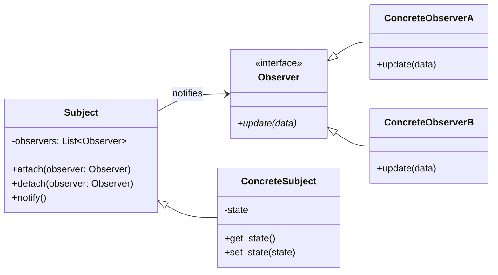

# The Observer Design Pattern: A Deep Dive

In system design and LLD, we often need multiple components to react automatically when the state of a central component changes. If the central component has to manually track and trigger updates on every dependent component, it leads to a tightly coupled system that is hard to scale and maintain.

The **Observer Design Pattern** is a behavioral pattern that solves this by defining a **one-to-many** dependency between objects. When one object (the **Subject**) changes state, all its dependents (the **Observers**) are notified and updated automatically.

---

## 1. The Core Problem: Polling vs. Push

Imagine building a **Weather Station Application**. The weather station measures temperature, humidity, and pressure. When these measurements change, multiple display boards need to update:
1.  **Current Conditions Display**
2.  **Statistics Display** (Min/Max/Avg)
3.  **Forecast Display** (Predicting rain based on pressure changes)

### The Inefficient Way: Polling
If the displays repeatedly ask the weather station for updates (e.g., every 5 seconds):
*   It wastes CPU cycles and network bandwidth when weather conditions haven't changed.
*   There's a delay between when the weather actually changes and when the displays catch up.

### The Coupled Way: Direct Invocation
If the weather station manually calls each display:
```python
class WeatherStation:
    def measurements_changed(self):
        # Tightly coupled list of display objects
        self.current_display.update(self.temp, self.humidity)
        self.statistics_display.update(self.temp)
        self.forecast_display.update(self.pressure)
```
If you want to add a 4th display type (e.g., a Mobile App alert system), you have to modify the `WeatherStation` class, violating the **Open-Closed Principle (OCP)**.

---

## 2. Observer Pattern Structure

The Observer pattern decouples the objects using interfaces:

1.  **Subject (Observable)**: The publisher of information. It holds a list of observers and provides methods to `attach()`, `detach()`, and `notify()`.
2.  **Observer**: The subscriber interface. It defines a method (typically `update()`) called by the subject.
3.  **Concrete Subject**: Holds the state of interest and triggers notifications when the state changes.
4.  **Concrete Observer**: Implements the `Observer` interface and defines how it reacts to updates.



---

## 3. Python Implementation

Here is how to implement the Weather Station using the Observer pattern:

```python
from abc import ABC, abstractmethod
from typing import List

# 1. Observer Interface
class Observer(ABC):
    @abstractmethod
    def update(self, temp: float, humidity: float, pressure: float) -> None:
        pass

# 2. Subject Interface
class Subject(ABC):
    def __init__(self):
        self._observers: List[Observer] = []

    def attach(self, observer: Observer) -> None:
        if observer not in self._observers:
            self._observers.append(observer)

    def detach(self, observer: Observer) -> None:
        self._observers.remove(observer)

    def notify(self, temp: float, humidity: float, pressure: float) -> None:
        for observer in self._observers:
            observer.update(temp, humidity, pressure)

# 3. Concrete Subject
class WeatherStation(Subject):
    def __init__(self):
        super().__init__()
        self._temp = 0.0
        self._humidity = 0.0
        self._pressure = 0.0

    def set_measurements(self, temp: float, humidity: float, pressure: float) -> None:
        self._temp = temp
        self._humidity = humidity
        self._pressure = pressure
        # Automatically notify all subscribers when data changes
        self.notify(self._temp, self._humidity, self._pressure)

# 4. Concrete Observers
class CurrentConditionsDisplay(Observer):
    def update(self, temp: float, humidity: float, pressure: float) -> None:
        print(f"Current Conditions Display: Temp = {temp}°C, Humidity = {humidity}%")

class ForecastDisplay(Observer):
    def update(self, temp: float, humidity: float, pressure: float) -> None:
        forecast = "Rainy" if pressure < 1000 else "Sunny & Clear"
        print(f"Forecast Display: Weather forecast is {forecast}")

# --- Usage ---
if __name__ == "__main__":
    weather_station = WeatherStation()
    
    # Create and register display boards
    current_display = CurrentConditionsDisplay()
    forecast_display = ForecastDisplay()
    
    weather_station.attach(current_display)
    weather_station.attach(forecast_display)
    
    # Simulate weather changing
    print("--- Weather change 1 ---")
    weather_station.set_measurements(28.5, 65.0, 990.0)
    
    # Detach a display
    weather_station.detach(current_display)
    
    print("\n--- Weather change 2 ---")
    weather_station.set_measurements(30.0, 60.0, 1012.0)
```

---

## 4. Pros & Cons of the Observer Pattern

### Pros
*   **Decoupled Architecture**: The Subject does not need to know anything about the concrete classes of the Observers; it only interacts via the `Observer` interface.
*   **Adheres to OCP**: You can add new Observer types without modifying any code in the Subject.
*   **Dynamic Subscriptions**: Observers can join or leave subscriptions at runtime.

### Cons
*   **Unordered Updates**: Observers are notified in no specific order, which can cause race conditions if they depend on each other.
*   **Memory Leaks (Lapsed Listener Problem)**: If an observer is no longer needed but forgot to unsubscribe, the Subject's observer list keeps a reference to it, preventing the garbage collector from cleaning it up.
*   **Cascading Updates**: A small change in the Subject can trigger a chain reaction of calculations across hundreds of observers, causing performance degradation.

---

## ✍️ Practice Exercises

We have prepared exercises for you in this directory:
- [exercise.py](file:///V:/workspace/system-design/lld/design-patterns/observer/exercise.py): Code skeleton for the practice challenges. Open it to write your implementation.

### Challenge: Stock Market Notification Engine
You are designing a stock market platform. Your system needs to monitor stock price changes and send real-time alerts.

1.  **Concrete Subject (`Stock`)**:
    *   Maintains parameters: `symbol` (e.g., `"AAPL"`) and `price` (e.g., `150.00`).
    *   Provides `set_price(new_price)` which updates the price and notifies all attached observers.
2.  **Concrete Observers**:
    *   **`PriceLogger`**: Logs the stock symbol and price every time it changes.
    *   **`StockAlertSystem`**: Sends a notification (print alert) only if the stock price drops below a user-defined threshold.
3.  **Exercise Goals**:
    *   Define the interfaces and classes.
    *   Make sure notifications are sent correctly to active subscribers.
    *   Handle dynamic unsubscribe testing.
