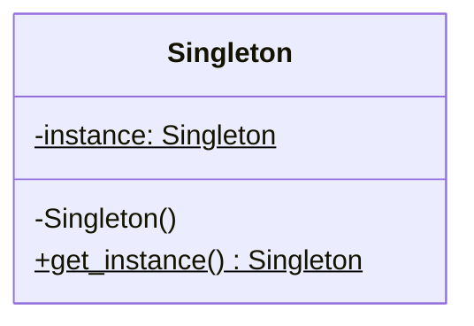

# The Singleton Design Pattern: A Deep Dive

The **Singleton Design Pattern** is one of the classic Gang of Four (GoF) creational design patterns. Its main objective is to ensure that a class has **only one instance** and to provide a **global point of access** to that instance.

---

## 1. Core Concept

In many application scenarios, you only need exactly one instance of a resource to avoid conflicts, coordinate actions across the system, or save resources. Common examples include:
*   **Database Connection Pools**: Managing a limited number of connections to a database.
*   **Logging Services**: Ensuring all parts of the application write to the same log file in a synchronized manner.
*   **Configuration Manager**: Reading configuration files once and caching them globally.
*   **Thread Pools / Cache Managers**: Centralizing resource allocation.


*Note: The `$` sign in UML denotes a static variable/method.*

---

## 2. Python Implementations

In Python, there are multiple ways to implement a Singleton. Each has its own trade-offs.

### Method 1: Overriding `__new__` (The Classic Way)
Python's `__new__` method is the actual constructor that creates the object instance, while `__init__` initializes it.

```python
class ClassicSingleton:
    _instance = None

    def __new__(cls, *args, **kwargs):
        if cls._instance is None:
            cls._instance = super().__new__(cls)
        return cls._instance

# --- Usage ---
s1 = ClassicSingleton()
s2 = ClassicSingleton()
print(s1 is s2)  # Output: True
```
> [!WARNING]
> **The `__init__` Trap**: Even though `__new__` returns the same instance, Python will run `__init__` every time you call `ClassicSingleton()`. If your `__init__` does expensive setups (like opening network sockets), it will be executed repeatedly.

---

### Method 2: Using Metaclasses (The Robust Way)
A metaclass defines how a class behaves. By using a metaclass, we can intercept class instantiation (making it behave like a singleton) and prevent the repeated `__init__` execution.

```python
class SingletonMeta(type):
    _instances = {}

    def __call__(cls, *args, **kwargs):
        if cls not in cls._instances:
            cls._instances[cls] = super().__call__(*args, **kwargs)
        return cls._instances[cls]

class DatabaseConnection(metaclass=SingletonMeta):
    def __init__(self):
        print("Initializing connection pool...") # Runs ONLY ONCE

# --- Usage ---
db1 = DatabaseConnection()  # Prints: Initializing connection pool...
db2 = DatabaseConnection()  # Prints nothing
print(db1 is db2)           # Output: True
```

---

### Method 3: Module-Level Import (The Pythonic Way)
In Python, modules are cached upon import. Any variables defined in a module are effectively singletons.

```python
# settings.py
class Settings:
    def __init__(self):
        self.theme = "dark"
        self.port = 8080

# Instantiate it right here in the module
app_settings = Settings()
```

```python
# main.py
from settings import app_settings

print(app_settings.theme)
```
This is the simplest approach and is highly recommended unless you specifically need lazy instantiation or inheritance.

---

## 3. Thread-Safe Singleton

In multi-threaded applications, multiple threads might attempt to create the instance at the exact same millisecond. To prevent race conditions, we must introduce thread locks.

In interviews, you will often be asked to implement **Double-Checked Locking**. It reduces the overhead of acquiring locks by checking if the instance is `None` *before* acquiring the lock, and checking it again *inside* the lock context.

```python
import threading

class ThreadSafeSingleton:
    _instance = None
    _lock = threading.Lock()

    def __new__(cls, *args, **kwargs):
        if cls._instance is None:  # First check (unlocked)
            with cls._lock:
                if cls._instance is None:  # Second check (locked)
                    cls._instance = super().__new__(cls)
        return cls._instance
```

---

## 4. Drawbacks and Criticism: Why is it an Anti-Pattern?

While useful, the Singleton pattern is often overused and is widely considered an **anti-pattern** for several reasons:

1.  **Violates Single Responsibility Principle (SRP)**: The class controls its own lifecycle (creation and access) in addition to its business responsibilities.
2.  **Tightly Couples Code**: High-level modules importing the singleton become tightly coupled to its implementation.
3.  **Hinders Unit Testing**: Singletons maintain state across tests. This can cause test pollution (where Test B fails because Test A changed a singleton's state). Mocking singletons is also notoriously difficult.
4.  **Hides Dependencies**: A constructor should explicitly declare what it needs. A class that pulls in a singleton hides its dependencies from developers reading the code.

---

## 🛠️ Practice Exercises

We have prepared exercises for you in this directory:
- [exercise.py](file:///V:/workspace/system-design/lld/design-patterns/singleton/exercise.py): Code skeleton for the practice challenges. Open it to write your implementation.

### Challenge: Implement a Multi-Threaded Config Manager
You are building an application configuration manager that loads configuration values from a simulated source. It must satisfy the following constraints:

1.  **Singleton Property**: Only a single instance of `ConfigurationManager` must exist.
2.  **Thread Safety**: It must be safe to access/initialize from multiple threads simultaneously. Use Double-Checked Locking.
3.  **No Repeat Initializations**: The configuration loading logic (simulated by reading a dict) must execute **only once**, regardless of how many times the class or factory method is called.
4.  **Methods needed**:
    *   `load_config(config_dict)`: Sets configuration parameters.
    *   `get(key)`: Retrieves config value for a key. Returns `None` if not found.
