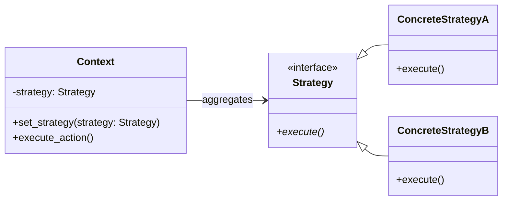

# The Strategy Design Pattern: A Deep Dive

In object-oriented design, we often encounter situations where a class can perform a specific task in multiple different ways. If we implement all these variations directly within the class using conditional statements (`if/else` or `switch`), it leads to highly coupled, rigid, and fragile code. 

The **Strategy Design Pattern** is a behavioral pattern that addresses this by defining a family of algorithms, encapsulating each one of them inside a separate class, and making them interchangeable at runtime.

---

## 1. The Core Problem: Conditional Explosion

Imagine building an **E-Commerce Checkout System**. During checkout, you need to calculate the final price of the shopping cart based on different discount types:
*   No Discount
*   Percentage Discount (e.g., 10% off)
*   Flat Discount (e.g., $20 off)
*   Seasonal/Holiday Discount

A naive implementation might look like this:

```python
class CheckoutSystem:
    def calculate_total(self, price: float, discount_type: str) -> float:
        if discount_type == "none":
            return price
        elif discount_type == "percentage":
            return price * 0.9  # 10% off
        elif discount_type == "flat":
            return price - 20.0 if price > 20 else 0
        elif discount_type == "seasonal":
            return price * 0.85 # 15% off
        else:
            raise ValueError("Unknown discount type")
```

This approach has major design flaws:
1.  **Violates Open-Closed Principle (OCP)**: Every time the marketing team wants to add a new type of discount, you have to open and modify the `CheckoutSystem` class.
2.  **Violates Single Responsibility Principle (SRP)**: The checkout system is handling both payment flow logic and the mathematical algorithms for all discount types.
3.  **Hard to Reuse & Test**: The individual calculation algorithms cannot be easily extracted, reused elsewhere, or unit-tested in isolation.

---

## 2. Strategy Pattern Structure

The Strategy pattern separates the class that uses an algorithm (called the **Context**) from the algorithms themselves (called **Strategies**).

1.  **Strategy Interface**: Declares a common interface for all supported algorithms.
2.  **Concrete Strategies**: Classes that implement the Strategy interface.
3.  **Context**: Maintains a reference to a Strategy object and delegates the algorithm execution to it.



---

## 3. Python Implementation

Here is how to refactor our checkout system using the Strategy pattern:

```python
from abc import ABC, abstractmethod

# 1. Strategy Interface
class DiscountStrategy(ABC):
    @abstractmethod
    def apply_discount(self, price: float) -> float:
        pass

# 2. Concrete Strategies
class NoDiscount(DiscountStrategy):
    def apply_discount(self, price: float) -> float:
        return price

class PercentageDiscount(DiscountStrategy):
    def __init__(self, percent: float):
        self.percent = percent

    def apply_discount(self, price: float) -> float:
        return price * (1.0 - self.percent)

class FlatDiscount(DiscountStrategy):
    def __init__(self, amount: float):
        self.amount = amount

    def apply_discount(self, price: float) -> float:
        return max(0.0, price - self.amount)

# 3. Context
class Checkout:
    def __init__(self, discount_strategy: DiscountStrategy):
        self._discount_strategy = discount_strategy

    def set_discount_strategy(self, discount_strategy: DiscountStrategy):
        """Allows changing strategy dynamically at runtime"""
        self._discount_strategy = discount_strategy

    def calculate_total(self, raw_price: float) -> float:
        # Delegate calculation to the selected strategy
        return self._discount_strategy.apply_discount(raw_price)

# --- Usage ---
if __name__ == "__main__":
    # Start checkout with flat discount
    checkout = Checkout(FlatDiscount(15.0))
    print(f"Total price with flat discount: ${checkout.calculate_total(100.0)}") # $85.0
    
    # Change strategy dynamically at runtime (e.g., customer applies a promo code)
    checkout.set_discount_strategy(PercentageDiscount(0.20)) # 20% off
    print(f"Total price with promo code: ${checkout.calculate_total(100.0)}") # $80.0
```

---

## 4. Pros & Cons of Strategy Pattern

### Pros
*   **Adheres to OCP**: You can add new strategies without changing the context class or existing strategies.
*   **Adheres to SRP**: Algorithms are isolated from client-facing logic.
*   **Dynamic Swap**: Strategies can be swapped at runtime (e.g., a routing algorithm switching from "fastest" to "shortest").
*   **Clean Code**: Removes complex, nested conditional blocks (`if-else`/`switch`).

### Cons
*   **Class Proliferation**: If you have many strategies, it increases the total number of classes in the codebase.
*   **Client Awareness**: The client code must understand the differences between strategies to select the appropriate one.

---

## ✍️ Practice Exercises

We have prepared exercises for you in this directory:
- [exercise.py](file:///V:/workspace/system-design/lld/design-patterns/strategy/exercise.py): Code skeleton for the practice challenges. Open it to write your implementation.

### Challenge: Dynamic Sorting Tool
You are building a custom data analysis tool that sorts lists of integers. Depending on the size of the data and constraints, users need to swap sorting algorithms:
1.  **Bubble Sort**: Best for tiny datasets or nearly sorted arrays.
2.  **Quick Sort**: High-performance sorting for large general datasets.
3.  **Merge Sort**: Safe sorting when stability is required.

Your task:
1.  Define the `SortStrategy` abstract base class with a `sort(data: list)` method.
2.  Implement the three concrete sorting strategies (using standard sorting logic or Python's built-in functions wrapped to mimic these algorithms).
3.  Implement a `Sorter` context class that maintains a sorting strategy and provides methods to `set_strategy()` and `execute_sort()`.
4.  Ensure that executing the sort returns a new sorted list (do not mutate the original data in a way that breaks other tests).
