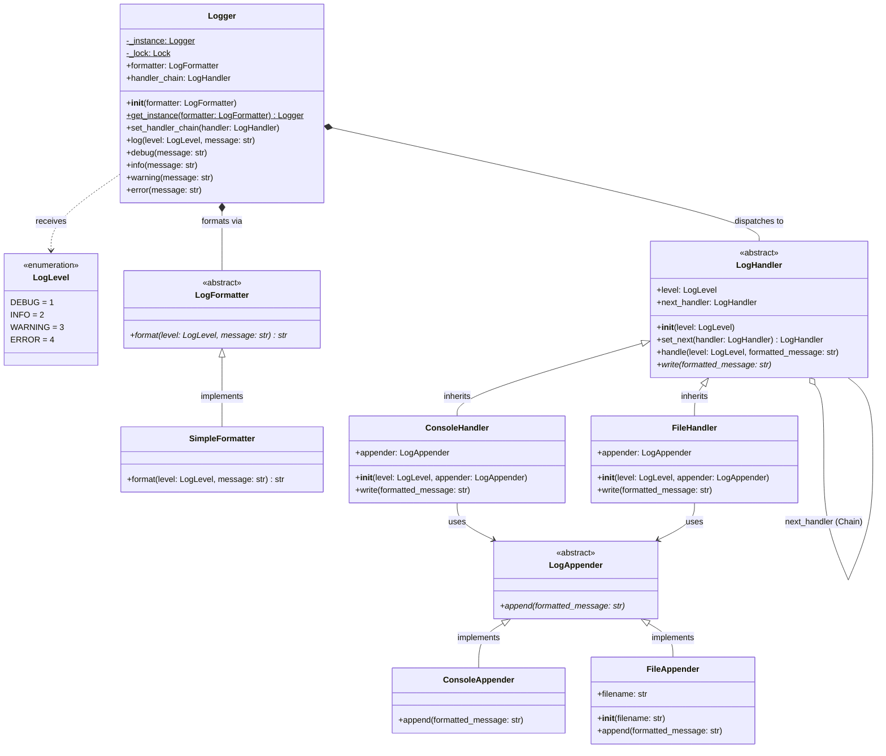
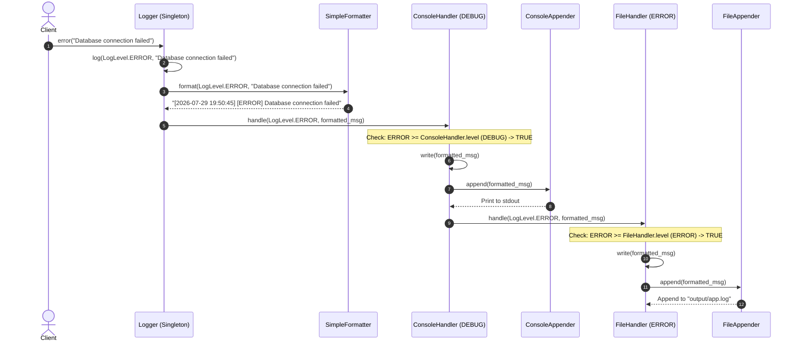

# Low-Level Design (LLD) Documentation: Logger System (Claude Architecture)

This document provides a comprehensive Low-Level Design (LLD) overview, class documentation, sequence flow, and a UML class diagram for the thread-safe Logger System implementation found in [logger-system-claude.py](file:///v:/workspace/system-design/lld/realworld-designs/logger-system/logger-system-claude.py).

---

## 1. Class Diagram (UML)

The following class diagram represents the structure, attributes, methods, and relationships of the classes implemented in this architecture.

---

## 2. Sequence Diagram (Logging Dispatch & Chain Execution)

The sequence diagram below illustrates how a log message is formatted and processed through the handler chain to target appenders.

---

## 3. Core Entities & Class Reference

### 3.1 Appenders (Output Destinations)

#### `LogAppender` (Abstract Base Class)
Decouples the handler logic from the physical destination where log entries are written.
*   **Methods**:
    *   `append(formatted_message: str)`: Abstract method to append the formatted log message.

#### `ConsoleAppender`
Inherits from `LogAppender`. Outputs formatted messages directly to `sys.stdout` via `print()`.

#### `FileAppender`
Inherits from `LogAppender`. Writes formatted messages to a log file.
*   **Attributes**:
    *   `filename: str`: File path location (e.g. `"output/app.log"`).
*   **Methods**:
    *   `append(formatted_message: str)`: Ensures parent directory exists (`os.makedirs`) and appends the message followed by a newline.

---

### 3.2 Formatters (Formatting Strategy)

#### `LogFormatter` (Abstract Base Class)
Defines the interface for formatting raw log messages.
*   **Methods**:
    *   `format(level: LogLevel, message: str) -> str`: Abstract method returning the structured log string.

#### `SimpleFormatter`
Concrete implementation of `LogFormatter`.
*   **Behavior**: Formats the log message into the standard format: `[YYYY-MM-DD HH:MM:SS] [LEVEL_NAME] message`.

---

### 3.3 Handlers (Chain of Responsibility)

#### `LogHandler` (Abstract Base Class)
Core node in the Chain of Responsibility.
*   **Attributes**:
    *   `level: LogLevel`: Minimum severity threshold required for this handler to execute.
    *   `next_handler: LogHandler`: Reference to the next node in the chain.
*   **Methods**:
    *   `set_next(handler: LogHandler) -> LogHandler`: Sets `next_handler` and returns it to allow fluent chaining.
    *   `handle(level: LogLevel, formatted_message: str)`: If `level >= self.level`, invokes `write()`. Always forwards the call to `next_handler` if present.
    *   `write(formatted_message: str)`: Abstract method delegated to concrete handlers.

#### `ConsoleHandler` & `FileHandler`
Concrete implementations of `LogHandler`.
*   **Attributes**:
    *   `appender: LogAppender`: Embedded output destination strategy.
*   **Methods**:
    *   `write(formatted_message: str)`: Invokes `self.appender.append(formatted_message)`.

---

### 3.4 Logger Facade & Singleton

#### `Logger`
Central thread-safe Singleton facade that orchestrates formatting, level helpers, and chain delegation.
*   **Attributes**:
    *   `_instance: Logger`: Cached static instance.
    *   `_lock: threading.Lock`: Reentrant lock ensuring thread-safe instantiation.
    *   `formatter: LogFormatter`: Formatting strategy instance.
    *   `handler_chain: LogHandler`: Head of the `LogHandler` chain.
*   **Methods**:
    *   `get_instance(formatter: LogFormatter = None) -> Logger` *(Static)*: Thread-safe double-checked lock pattern for retrieving the singleton.
    *   `set_handler_chain(handler: LogHandler)`: Binds the root handler chain to the logger.
    *   `log(level: LogLevel, message: str)`: Formats the message and passes it to `handler_chain.handle()`.
    *   `debug()`, `info()`, `warning()`, `error()`: Helper shortcut methods for specific severity levels.

---

## 4. Design Patterns Applied

1.  **Chain of Responsibility Pattern**
    *   Configured via `LogHandler` subclasses (`ConsoleHandler`, `FileHandler`).
    *   Allows messages to filter down a pipeline of handlers independently based on log levels.

2.  **Strategy Pattern (Formatting & Appending)**
    *   Log formatting is decoupled into `LogFormatter` implementations.
    *   Log target outputs are decoupled into `LogAppender` implementations (`ConsoleAppender`, `FileAppender`).

3.  **Thread-Safe Singleton Pattern**
    *   `Logger.get_instance()` uses a `threading.Lock()` to prevent race conditions in multi-threaded applications.

4.  **Facade Pattern**
    *   `Logger` acts as a facade providing simple helper methods (`debug()`, `info()`, `warning()`, `error()`) hiding internal formatting and chain propagation complexity from the client.
