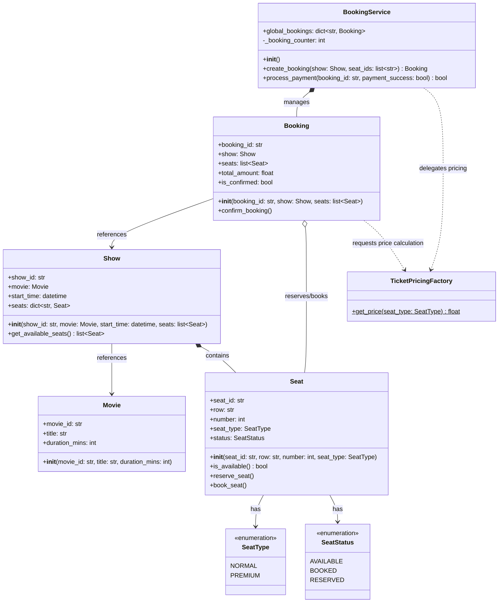

# Low-Level Design (LLD) Documentation: Movie Ticket Booking System

This document provides a comprehensive Low-Level Design (LLD) overview, class documentation, and a UML class diagram for the Movie Ticket Booking implementation found in [movie_ticket_gemini.py](file:///v:/workspace/system-design/lld/realworld-designs/movie_ticket_booking/movie_ticket_gemini.py).

---

## 1. Class Diagram (UML)

The following class diagram represents the structure, attributes, methods, and relationships of the classes implemented in the system.

---

## 2. Core Entities & Class Reference

### 2.1 Enums

#### `SeatStatus`
Represents the booking lifecycle states for a particular seat in a show.
*   `AVAILABLE`: Seat is open for reservation/booking.
*   `BOOKED`: Seat is confirmed and paid for.
*   `RESERVED`: Seat is temporarily locked during the payment check-out phase.

#### `SeatType`
Represents the category of seat which determines its base price.
*   `NORMAL`: Standard seating.
*   `PREMIUM`: Recliners or prime locations with higher pricing.

---

### 2.2 Core Models

#### `Movie`
Represents the details of a film being screened.
*   **Attributes**:
    *   `movie_id: str`: Unique identifier of the movie.
    *   `title: str`: The name of the movie.
    *   `duration_mins: int`: The duration of the film in minutes.

#### `Seat`
Represents an individual seat inside a screening hall.
*   **Attributes**:
    *   `seat_id: str`: Unique key for the seat (e.g., "A1").
    *   `row: str`: Row letter (e.g., "A").
    *   `number: int`: Seat column number (e.g., 1).
    *   `seat_type: SeatType`: Category (`NORMAL` or `PREMIUM`).
    *   `status: SeatStatus`: Current occupancy state of the seat.
*   **Methods**:
    *   `is_available() -> bool`: Returns `True` if seat is vacant.
    *   `reserve_seat()`: Sets status to `RESERVED` during ticket creation.
    *   `book_seat()`: Sets status to `BOOKED` after successful payment.

#### `Show`
Represents a specific screening of a movie at a given time.
*   **Attributes**:
    *   `show_id: str`: Unique identifier of the show.
    *   `movie: Movie`: The movie being screened.
    *   `start_time: datetime`: The showtime.
    *   `seats: dict[str, Seat]`: Fast $O(1)$ lookup map containing all seats mapped by `seat_id`.
*   **Methods**:
    *   `get_available_seats() -> list[Seat]`: Returns a list of all unoccupied seats for the show.

---

### 2.3 Booking & Operations

#### `TicketPricingFactory`
A simple factory class that encapsulates the pricing logic for ticket types.
*   **Methods**:
    *   `get_price(seat_type: SeatType) -> float`: Returns the fee for the seat category (e.g., ₹150.0 for `NORMAL` and ₹300.0 for `PREMIUM`).

#### `Booking`
Represents a transaction entry initiated by a user booking seats.
*   **Attributes**:
    *   `booking_id: str`: Unique ID of the transaction (e.g., "BKG-1001").
    *   `show: Show`: The associated show details.
    *   `seats: list[Seat]`: List of seats reserved under this booking.
    *   `total_amount: float`: Sum of individual seat prices calculated via the pricing factory.
    *   `is_confirmed: bool`: Indicates if payment has cleared.
*   **Methods**:
    *   `confirm_booking()`: Finalizes the seats status as `BOOKED` and marks the booking confirmed.

#### `BookingService`
The orchestrator managing booking processes and state transitions.
*   **Attributes**:
    *   `global_bookings: dict[str, Booking]`: Active bookings keyed by ID.
    *   `_booking_counter: int`: Auto-incrementing counter to generate unique booking IDs.
*   **Methods**:
    *   `create_booking(show: Show, seat_ids: list[str]) -> Booking`:
        1. Validates that all requested seats exist and are `AVAILABLE`.
        2. Sets selected seats status to `RESERVED` (temporary hold).
        3. Creates and registers a `Booking` instance in `global_bookings`.
    *   `process_payment(booking_id: str, payment_success: bool) -> bool`:
        *   If `payment_success` is `True`: Confirms the booking and sets the seats to `BOOKED`.
        *   If `payment_success` is `False`: Releases all seats back to `AVAILABLE` status and discards the booking record.
