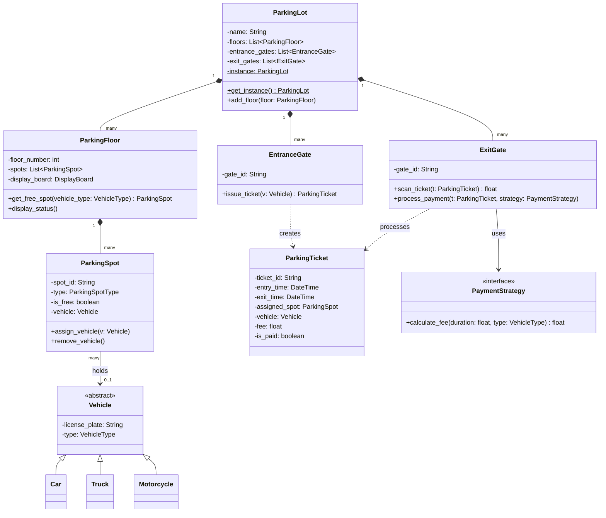

# Low-Level Design (LLD): Parking Lot System

Designing a **Parking Lot System** is one of the most classic Low-Level Design (LLD) interview questions. It tests your ability to model real-world entities, establish relationships between classes, apply SOLID principles, design patterns, and handle concurrency.

---

## 1. Requirements & System Scope

Before writing code, we must define the scope of our LLD:

### Core Requirements
1.  **Multi-Floor Support**: The parking lot should have multiple floors (levels).
2.  **Diverse Parking Spots**: The system supports multiple types of parking spots:
    *   `MOTORCYCLE` (for bikes)
    *   `COMPACT` (for standard cars)
    *   `LARGE` (for trucks, vans, and buses)
    *   `HANDICAPPED` (reserved spots)
3.  **Diverse Vehicles**: The system accepts different vehicle types (`Car`, `Truck`, `Motorcycle`, `Van`), which can only park in compatible spots.
4.  **Entrance & Exit Gates**:
    *   **Entrance Gate**: Checks availability, issues a ticket with an entry timestamp, and assigns a specific spot.
    *   **Exit Gate**: Scans the ticket, calculates the parking fee, processes payment, and releases the spot.
5.  **Dynamic Display Boards**: Each floor has a display board showing the number of available free spots for each type in real-time.
6.  **Flexible Pricing**: The system supports different pricing models (e.g., flat rates, hourly rates based on vehicle type).
7.  **Concurrency / Thread Safety**: Multiple entrance/exit gates operate simultaneously. The spot allocation must be thread-safe to prevent double-booking the same spot.

---

## 2. Low-Level Class Diagram (UML)



---

## 3. Design Patterns Applied

To make this design production-grade, we incorporate several design patterns:

1.  **Singleton Pattern**:
    *   The `ParkingLot` class should have only one instance globally to represent the physical building. We apply the thread-safe Singleton pattern here.
2.  **Factory Pattern**:
    *   Used to instantiate different types of `Vehicle` objects based on inputs.
3.  **Strategy Pattern**:
    *   The pricing engine uses a `PaymentStrategy` interface. This allows us to easily switch between `FlatRateStrategy`, `HourlyRateStrategy`, or introduce weekend surge-pricing strategies without modifying the gates.
4.  **Observer Pattern**:
    *   When a `ParkingSpot` status changes (free to occupied, or vice-versa), the `ParkingFloor`'s `DisplayBoard` is notified and updates its count automatically.

---

## 4. Code Implementation

The complete, working implementation of the system is stored in:
- [parking_lot.py](file:///V:/workspace/system-design/lld/realworld-designs/parking-lot/parking_lot.py)

This Python script models all components, implements **thread-safe spot allocation** using reentrant locks (`threading.RLock`), and simulates a real-life operation flow.

### Spot Allocation Compatibility Rules
Our allocation algorithm implements the following logic:
*   `Motorcycle` can park in `MOTORCYCLE`, `COMPACT`, or `LARGE` spots.
*   `Car` can park in `COMPACT` or `LARGE` spots.
*   `Truck` and `Van` can *only* park in `LARGE` spots.
*   `Handicapped` spots are reserved strictly for vehicles possessing a handicapped flag.

---

## 5. How to Run the Simulation

To execute the interactive simulation and inspect the logs:
```bash
python lld/realworld-designs/parking-lot/parking_lot.py
```
This will spin up a multi-floor parking lot, spawn multiple threads representing cars and motorcycles entering and exiting, calculate dynamic fees, and output the status.
