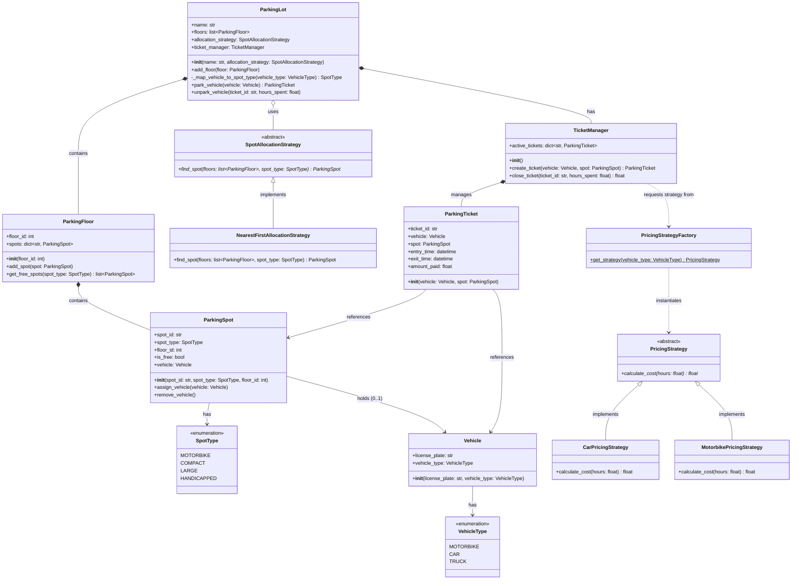

# Low-Level Design (LLD) Documentation: Parking Lot Gemini

This document provides a comprehensive Low-Level Design (LLD) overview, class documentation, and a UML diagram for the Parking Lot implementation found in [parking_lot_gemini.py](file:///v:/workspace/system-design/lld/realworld-designs/parking-lot/parking_lot_gemini.py).

---

## 1. Class Diagram (UML)

The following class diagram represents the structure, attributes, methods, and relationships of the classes implemented in the system.

---

## 2. Core Entities & Class Reference

### 2.1 Enums

#### `VehicleType`
Represents the types of vehicles that can enter the parking lot.
*   `MOTORBIKE`: Two-wheelers.
*   `CAR`: Standard cars.
*   `TRUCK`: Large heavy vehicles.

#### `SpotType`
Represents the categorization of parking spots based on the size and eligibility criteria.
*   `MOTORBIKE`: Reserved for motorbikes.
*   `COMPACT`: Reserved for standard cars.
*   `LARGE`: Reserved for trucks.
*   `HANDICAPPED`: Reserved for drivers with disabilities.

---

### 2.2 Models & Management

#### `Vehicle`
Represents a vehicle attempting to park.
*   **Attributes**:
    *   `license_plate: str`: Registration plate of the vehicle.
    *   `vehicle_type: VehicleType`: The type category of the vehicle.

#### `ParkingSpot`
Represents an individual physical spot inside the parking lot.
*   **Attributes**:
    *   `spot_id: str`: Unique identifier of the spot (e.g., "S-101").
    *   `spot_type: SpotType`: Type of the spot defining compatible vehicle types.
    *   `floor_id: int`: The floor index where the spot is located.
    *   `is_free: bool`: Flags whether the spot is currently vacant.
    *   `vehicle: Vehicle`: The vehicle currently parked in this spot, or `None` if free.
*   **Methods**:
    *   `assign_vehicle(vehicle: Vehicle)`: Assigns a vehicle and marks the spot as occupied.
    *   `remove_vehicle()`: Clears the vehicle and marks the spot as free.

#### `ParkingFloor`
Represents a single level of the parking structure.
*   **Attributes**:
    *   `floor_id: int`: Floor level identifier.
    *   `spots: dict[str, ParkingSpot]`: Map containing all spots on this floor indexed by their `spot_id`.
*   **Methods**:
    *   `add_spot(spot: ParkingSpot)`: Registers a new parking spot on the floor.
    *   `get_free_spots(spot_type: SpotType) -> list[ParkingSpot]`: Returns a list of all unoccupied spots of a given type.

---

### 2.3 Ticket & Billing System

#### `ParkingTicket`
Represents the receipt given to a customer when parking.
*   **Attributes**:
    *   `ticket_id: str`: Truncated UUID uniquely identifying the ticket.
    *   `vehicle: Vehicle`: The vehicle associated with the ticket.
    *   `spot: ParkingSpot`: The assigned parking spot.
    *   `entry_time: datetime`: Timestamp when the vehicle entered.
    *   `exit_time: datetime`: Timestamp when the vehicle exited (defaults to `None`).
    *   `amount_paid: float`: Total fee paid at exit.

#### `TicketManager`
Manages the lifecycle of active parking tickets.
*   **Attributes**:
    *   `active_tickets: dict[str, ParkingTicket]`: Collection of active, unpaid tickets.
*   **Methods**:
    *   `create_ticket(vehicle: Vehicle, spot: ParkingSpot) -> ParkingTicket`: Spawns a new ticket and registers it in `active_tickets`.
    *   `close_ticket(ticket_id: str, hours_spent: float) -> float`: Looks up the ticket, retrieves the appropriate pricing scheme using `PricingStrategyFactory`, calculates the cost, records exit time, removes the ticket from active tracking, and returns the calculated price.

---

### 2.4 Design Patterns: Strategy & Factories

#### `SpotAllocationStrategy` (Abstract Base Class)
Defines the contract for algorithms that allocate spots.
*   **Methods**:
    *   `find_spot(floors: list[ParkingFloor], spot_type: SpotType) -> ParkingSpot`: Selects an appropriate free spot matching the requested type from the list of floors.

#### `NearestFirstAllocationStrategy`
A concrete allocation strategy that prioritizes spots on the lowest floors first.
*   **Logic**: Iterates over the floors sorted by `floor_id` in ascending order, and searches for free spots of the requested type. Within a floor, it returns the spot with the smallest lexicographical `spot_id`.

#### `PricingStrategy` (Abstract Base Class)
Defines the contract for calculating parking fees.
*   **Methods**:
    *   `calculate_cost(hours: float) -> float`: Calculates the total fee based on duration.

#### `CarPricingStrategy`
Concrete pricing algorithm for cars.
*   **Calculation**: Base price of ₹50.0 minimum, and ₹30.0 per hour.

#### `MotorbikePricingStrategy`
Concrete pricing algorithm for motorbikes.
*   **Calculation**: Base price of ₹20.0 minimum, and ₹10.0 per hour.

#### `PricingStrategyFactory`
A simple factory to instantiate and return the correct pricing strategy for a given vehicle type.
*   **Static Methods**:
    *   `get_strategy(vehicle_type: VehicleType) -> PricingStrategy`: Maps `VehicleType` to the corresponding `PricingStrategy` implementation. Defaults to `CarPricingStrategy`.

---

### 2.5 Orchestrator / Entry Point

#### `ParkingLot`
Acts as the central context class (Facade) coordinating floors, allocation, and tickets.
*   **Attributes**:
    *   `name: str`: Name of the parking facility.
    *   `floors: list[ParkingFloor]`: Registered floors.
    *   `allocation_strategy: SpotAllocationStrategy`: Strategy injected for spot search.
    *   `ticket_manager: TicketManager`: Internal manager tracking tickets.
*   **Methods**:
    *   `add_floor(floor: ParkingFloor)`: Adds a floor to the system.
    *   `_map_vehicle_to_spot_type(vehicle_type: VehicleType) -> SpotType`: Private helper to map vehicle type categories to physical spot type compatibility.
    *   `park_vehicle(vehicle: Vehicle) -> ParkingTicket`: Maps the vehicle, queries the allocation strategy, assigns the spot, issues a ticket, and logs the operation status.
    *   `unpark_vehicle(ticket_id: str, hours_spent: float)`: Frees the occupied spot, closes the ticket using the ticket manager, and outputs the calculated fare and checkout log.

---

## 3. Design Principles & Patterns Applied

1.  **Strategy Pattern (Spot Allocation & Pricing)**
    *   Spot allocation is decoupled via `SpotAllocationStrategy`. New allocation behaviors (e.g. `RandomAllocationStrategy`, `VipPreferredAllocationStrategy`) can be introduced without modifying the core `ParkingLot` class.
    *   Pricing rules are decoupled via `PricingStrategy` and `PricingStrategyFactory`, allowing different pricing models for each vehicle type to be added cleanly without modifying ticketing or exit-gate controllers.

2.  **Facade Pattern**
    *   The `ParkingLot` class serves as a Facade. It simplifies the client interface by wrapping complex interactions between the `TicketManager`, `ParkingFloor`, `ParkingSpot`, and various strategies into clean `park_vehicle` and `unpark_vehicle` operations.

3.  **SOLID Principles**
    *   **Single Responsibility Principle (SRP)**: Classes are highly focused (e.g., `ParkingFloor` only manages floor spots, `TicketManager` only handles ticket lifecycle).
    *   **Open-Closed Principle (OCP)**: Extending the system with new vehicle types or spot search algorithms requires writing new subclasses/strategies rather than rewriting existing system code.
    *   **Liskov Substitution Principle (LSP)**: `NearestFirstAllocationStrategy` is completely swappable with any other `SpotAllocationStrategy` subtype.
    *   **Dependency Inversion Principle (DIP)**: `ParkingLot` depends on the abstraction `SpotAllocationStrategy` rather than concrete implementations.
