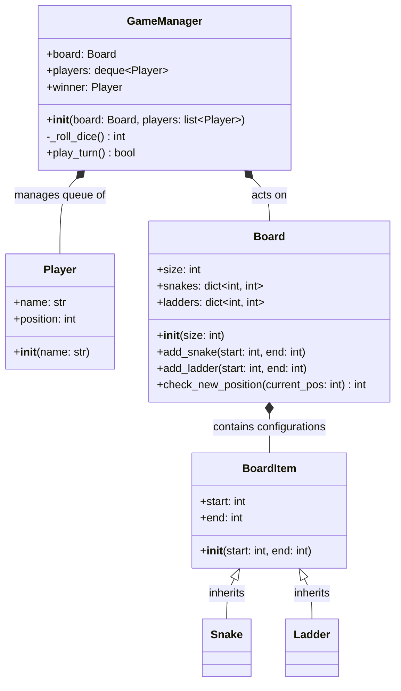

# Low-Level Design (LLD) Documentation: Snake and Ladder

This document provides a comprehensive Low-Level Design (LLD) overview, class documentation, and a UML class diagram for the Snake and Ladder game implementation found in [snake-and-ladder-gemini.py](file:///v:/workspace/system-design/lld/realworld-designs/snake-and-ladder/snake-and-ladder-gemini.py).

---

## 1. Class Diagram (UML)

The following class diagram represents the structure, attributes, methods, and relationships of the classes implemented in the system.

---

## 2. Core Entities & Class Reference

### 2.1 Game Models

#### `Player`
Represents a participant in the match.
*   **Attributes**:
    *   `name: str`: The name of the player.
    *   `position: int`: Current square position on the board. All players begin at `0` (outside the board).

#### `BoardItem` (Abstract Concept / Base Class)
Represents a structural element on the board bridging two tiles.
*   **Attributes**:
    *   `start: int`: The origin tile index of the element.
    *   `end: int`: The destination tile index of the element.

#### `Snake`
Inherits from `BoardItem`. Represents a snake obstacle where `start > end`. Land on the snake's head (`start`) and you slide down to its tail (`end`).

#### `Ladder`
Inherits from `BoardItem`. Represents a ladder shortcut where `start < end`. Land on the ladder's bottom (`start`) and you climb up to the top (`end`).

---

### 2.2 Board Representation

#### `Board`
Represents the playing field containing layout properties and tile configurations.
*   **Attributes**:
    *   `size: int`: Total number of tiles on the board (defaults to `100`).
    *   `snakes: dict[int, int]`: Mapping representing snake locations from start head to end tail.
    *   `ladders: dict[int, int]`: Mapping representing ladder locations from start bottom to end top.
*   **Methods**:
    *   `add_snake(start: int, end: int)`: Adds a snake configuration.
    *   `add_ladder(start: int, end: int)`: Adds a ladder configuration.
    *   `check_new_position(current_pos: int) -> int`: Resolves the final tile index recursively if the player lands on a snake head or ladder bottom. This ensures chain-resolution if nested elements exist.

---

### 2.3 Game Orchestrator

#### `GameManager`
The controller class executing the turn loop, player rotation, dice rolls, and boundary constraints.
*   **Attributes**:
    *   `board: Board`: The board instance the game is played on.
    *   `players: deque[Player]`: A double-ended queue (`collections.deque`) maintaining the players in a round-robin rotation.
    *   `winner: Player`: The player who reached the winning spot (defaults to `None`).
*   **Methods**:
    *   `_roll_dice() -> int`: Internal helper simulating a standard six-sided die returning a value between `1` and `6`.
    *   `play_turn() -> bool`: Coordinates a single turn execution:
        1.  Pops the active player from the left of the `players` deque.
        2.  Rolls the die and calculates the candidate position.
        3.  Checks bounds: if the target exceeds the board size, the turn is skipped.
        4.  Queries the `Board` to resolve final coordinates (applying snakes and ladders).
        5.  Checks for the win condition (`position == board.size`).
        6.  If won, assigns `winner` and returns `True`. Otherwise, appends the player to the right of the `players` deque and returns `False`.
