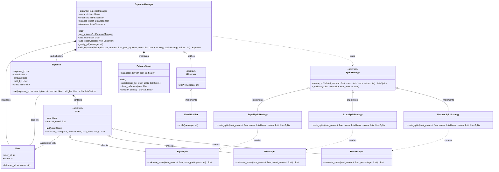
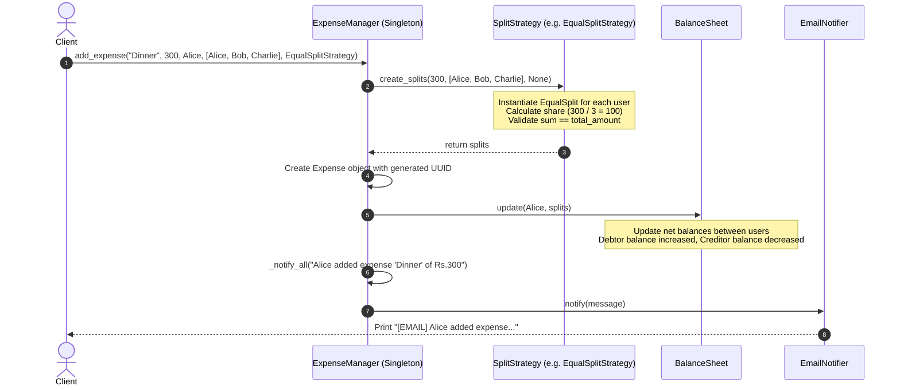

# Low-Level Design (LLD) Documentation: Splitwise System

This document provides a comprehensive Low-Level Design (LLD) overview, class documentation, sequence flow, and a UML class diagram for the Splitwise expense-sharing system implementation found in [splitwise_claude.py](file:///v:/workspace/system-design/lld/realworld-designs/splitwise/splitwise_claude.py).

---

## 1. Class Diagram (UML)

The following class diagram represents the structure, attributes, methods, and relationships of the classes implemented in the Splitwise application.

---

## 2. Sequence Diagram (Add Expense Workflow)

The sequence diagram below demonstrates how an expense is created, split according to a strategy, recorded in the balance sheet, and broadcast to observers.

---

## 3. Core Entities & Class Reference

### 3.1 Domain Models & Split Abstractions

#### `User`
Represents a participant in shared expenses.
*   **Attributes**:
    *   `user_id: str`: Unique identifier for the user (e.g., `"u1"`).
    *   `name: str`: Display name of the user.

#### `Split` (Abstract Base Class)
Abstract model representing an individual user's financial share in a specific expense.
*   **Attributes**:
    *   `user: User`: The user associated with this split.
    *   `amount_owed: float`: Calculated monetary share owed by this user.
*   **Methods**:
    *   `calculate_share(total_amount: float, split_value: Any)`: Abstract method to calculate and set `amount_owed`.

#### `EqualSplit`
Concrete `Split` subclass for equal divisions.
*   **Calculation**: `amount_owed = round(total_amount / num_participants, 2)`

#### `ExactSplit`
Concrete `Split` subclass for specific dollar amount allocations.
*   **Calculation**: `amount_owed = round(exact_amount, 2)`

#### `PercentSplit`
Concrete `Split` subclass for percentage-based divisions.
*   **Calculation**: `amount_owed = round(total_amount * percentage / 100, 2)`

---

### 3.2 Strategy Layer (Split Strategies)

#### `SplitStrategy` (Abstract Base Class)
Defines the strategy contract for parsing participants, generating splits, and validating total amounts.
*   **Methods**:
    *   `create_splits(total_amount: float, users: list[User], values: list = None) -> list[Split]`: Abstract method creating a list of split objects.
    *   `_validate(splits: list[Split], total_amount: float)`: Helper method verifying that the sum of `amount_owed` across all splits equals `total_amount` (within a `0.01` tolerance). Raises an exception if validation fails.

#### `EqualSplitStrategy`
Divides `total_amount` equally among all participating users.

#### `ExactSplitStrategy`
Assigns specific exact values to each user. Validates that `len(users) == len(values)`.

#### `PercentSplitStrategy`
Assigns percentage portions to each user. Validates that `len(users) == len(values)` and `sum(values) == 100`.

---

### 3.3 Observer & Notification Layer

#### `Observer` (Abstract Base Class)
Defines the interface for real-time notification listeners.
*   **Methods**:
    *   `notify(message: str)`: Abstract notification callback.

#### `EmailNotifier`
Concrete observer implementation printing notification logs (`[EMAIL] message`).

---

### 3.4 Accounting & Expense Management

#### `Expense`
Immutable record of a processed transaction.
*   **Attributes**:
    *   `expense_id: str`: Automatically generated UUID.
    *   `description: str`: Expense label (e.g. `"Dinner"`).
    *   `amount: float`: Total monetary value of the expense.
    *   `paid_by: User`: The user who paid the bill up front.
    *   `splits: list[Split]`: The list of split breakdowns calculated for this expense.

#### `BalanceSheet`
Maintains a 2D map tracking net balances between all registered users.
*   **Attributes**:
    *   `balances: defaultdict[str, defaultdict[str, float]]`: `balances[userA_id][userB_id]` represents net amount `userA` owes `userB` (positive) or `userB` owes `userA` (negative).
*   **Methods**:
    *   `update(paid_by: User, splits: list[Split])`: Adjusts bilateral balances for each participant against the payer (`paid_by`).
    *   `show_balances(user: User)`: Prints formatted output listing who `user` owes and who owes `user`.
    *   `simplify_debts() -> dict[str, float]`: Computes overall net balance per user for cash-flow simplification.

#### `ExpenseManager` (Singleton Orchestrator)
Central context manager coordinating users, expenses, accounting, and observer notifications.
*   **Attributes**:
    *   `_instance: ExpenseManager`: Static singleton instance.
    *   `users: dict[str, User]`: User lookup table mapped by `user_id`.
    *   `expenses: list[Expense]`: Transaction history log.
    *   `balance_sheet: BalanceSheet`: System-wide accounting instance.
    *   `observers: list[Observer]`: Registered notification observers.
*   **Methods**:
    *   `get_instance() -> ExpenseManager` *(Static)*: Returns the singleton instance.
    *   `add_user(user: User)`: Registers a user in the system.
    *   `add_observer(observer: Observer)`: Registers a new observer listener.
    *   `add_expense(...)`: Uses the passed `SplitStrategy` to calculate splits, records the `Expense`, updates `BalanceSheet`, and notifies registered observers.

---

## 4. Design Patterns Applied

1.  **Strategy Pattern**
    *   Encapsulated via `SplitStrategy` subclasses (`EqualSplitStrategy`, `ExactSplitStrategy`, `PercentSplitStrategy`).
    *   Allows flexible addition of custom splitting logic (e.g. `ShareRatioSplitStrategy`) without altering the core `ExpenseManager`.

2.  **Observer Pattern**
    *   Implemented via `Observer` interface and `EmailNotifier`.
    *   Decouples expense processing from notification channels (Email, SMS, Push Notifications).

3.  **Singleton Pattern**
    *   Enforced in `ExpenseManager` to ensure a single, consistent state for users, expense history, and the central balance sheet.
