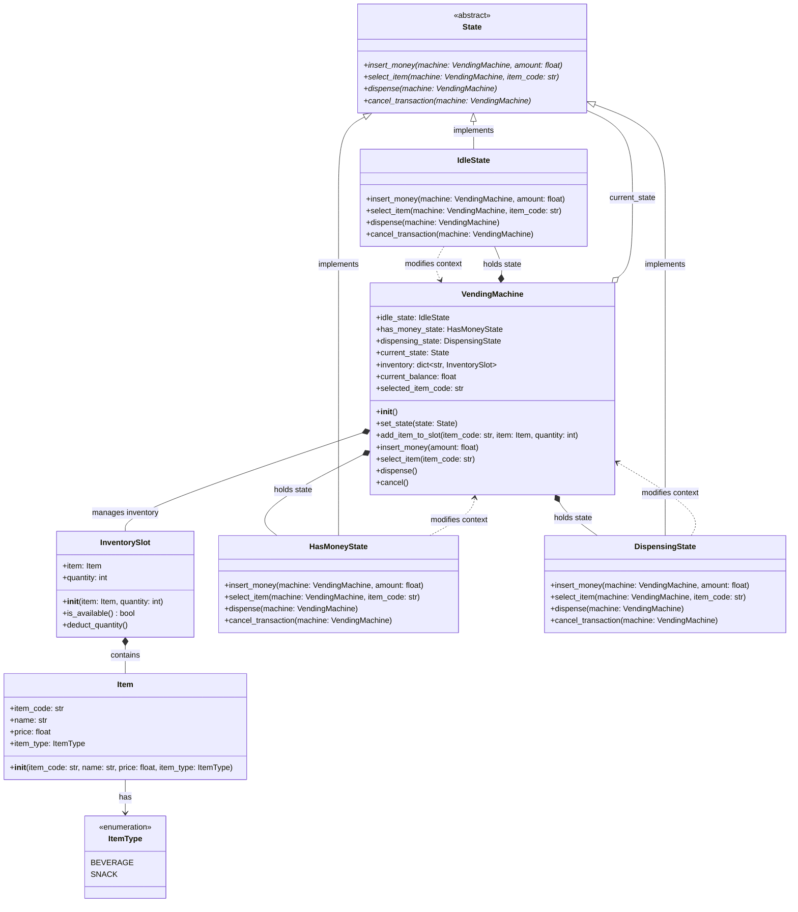
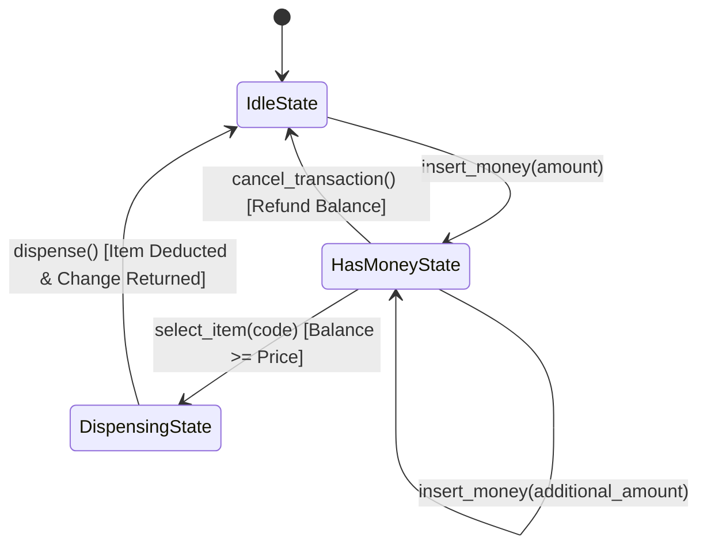

# Low-Level Design (LLD) Documentation: Vending Machine System

This document provides a comprehensive Low-Level Design (LLD) overview, class documentation, state transition flow, and a UML class diagram for the Vending Machine system implemented in [vending_machine_gemini.py](file:///v:/workspace/system-design/lld/realworld-designs/vending-machine/vending_machine_gemini.py).

---

## 1. Class Diagram (UML)

The following class diagram represents the structure, attributes, methods, and relationships of all components in the system.

---

## 2. State Machine Diagram

The system heavily relies on the **State Pattern** to handle state transitions cleanly:

---

## 3. Core Entities & Class Reference

### 3.1 Data & Inventory Layer

#### `ItemType` (Enum)
Categorizes items stored in the vending machine.
*   `BEVERAGE`: Liquid drinks (e.g. Coca-Cola, Water).
*   `SNACK`: Edible packaged snacks (e.g. Lays Chips).

#### `Item`
Represents an individual product available for sale.
*   **Attributes**:
    *   `item_code: str`: Unique slot code (e.g., "A1", "B1").
    *   `name: str`: Display name of the item.
    *   `price: float`: Cost of the item.
    *   `item_type: ItemType`: Category type of the item.

#### `InventorySlot`
Wraps an `Item` along with stock quantity tracking inside a specific slot.
*   **Attributes**:
    *   `item: Item`: Reference to the product item.
    *   `quantity: int`: Current stock count in the slot.
*   **Methods**:
    *   `is_available() -> bool`: Returns `True` if stock quantity > 0.
    *   `deduct_quantity()`: Decrements the stock quantity by 1 upon dispensing.

---

### 3.2 State Pattern Layer

#### `State` (Abstract Base Class)
Defines the uniform interface for all operational states of the Vending Machine.
*   **Abstract Methods**:
    *   `insert_money(machine, amount: float)`
    *   `select_item(machine, item_code: str)`
    *   `dispense(machine)`
    *   `cancel_transaction(machine)`

#### `IdleState`
Default state when no active customer transaction is occurring.
*   **Behaviors**:
    *   `insert_money`: Adds amount to `machine.current_balance` and transitions state to `HasMoneyState`.
    *   `select_item`, `dispense`, `cancel_transaction`: Rejects action with warning logs.

#### `HasMoneyState`
State active when money has been inserted into the machine.
*   **Behaviors**:
    *   `insert_money`: Accumulates balance.
    *   `select_item`: Validates stock availability and balance. If sufficient, sets `selected_item_code` and transitions state to `DispensingState`.
    *   `cancel_transaction`: Refunds `current_balance`, resets balance to `0.0`, and transitions back to `IdleState`.
    *   `dispense`: Warns user to select an item first.

#### `DispensingState`
State active while the item is being dispensed and change is calculated.
*   **Behaviors**:
    *   `dispense`: Deducts stock from `InventorySlot`, calculates change (`current_balance - item.price`), resets context variables, and transitions back to `IdleState`.
    *   `insert_money`, `select_item`, `cancel_transaction`: Blocked during active dispensing.

---

### 3.3 Context Layer

#### `VendingMachine`
The context class orchestrating inventory, balances, and state delegations.
*   **Attributes**:
    *   `idle_state: IdleState`: Pre-instantiated state object.
    *   `has_money_state: HasMoneyState`: Pre-instantiated state object.
    *   `dispensing_state: DispensingState`: Pre-instantiated state object.
    *   `current_state: State`: Pointer to the active state object.
    *   `inventory: dict[str, InventorySlot]`: Map of slot code to `InventorySlot`.
    *   `current_balance: float`: Accumulated money inserted by the user.
    *   `selected_item_code: str`: Selected product key.
*   **Methods**:
    *   `set_state(state: State)`: Updates `current_state`.
    *   `add_item_to_slot(item_code, item, quantity)`: Registers products in the machine inventory.
    *   `insert_money(amount)`: Delegated to `current_state.insert_money()`.
    *   `select_item(item_code)`: Delegated to `current_state.select_item()`.
    *   `dispense()`: Delegated to `current_state.dispense()`.
    *   `cancel()`: Delegated to `current_state.cancel_transaction()`.

---

## 4. Design Principles & Patterns Applied

1.  **State Pattern**
    *   Encapsulates state-specific behaviors inside dedicated state classes (`IdleState`, `HasMoneyState`, `DispensingState`).
    *   Eliminates complex `if-else` or `switch-case` conditional logic based on state flags inside `VendingMachine`.

2.  **Single Responsibility Principle (SRP)**
    *   `InventorySlot` handles stock tracking.
    *   `State` classes handle user action validation & state transitions.
    *   `VendingMachine` maintains context data and delegates actions.

3.  **Open-Closed Principle (OCP)**
    *   Adding a new state (e.g. `MaintenanceState` or `OutOfServiceState`) requires introducing a new `State` subclass without altering existing state classes or context methods.
